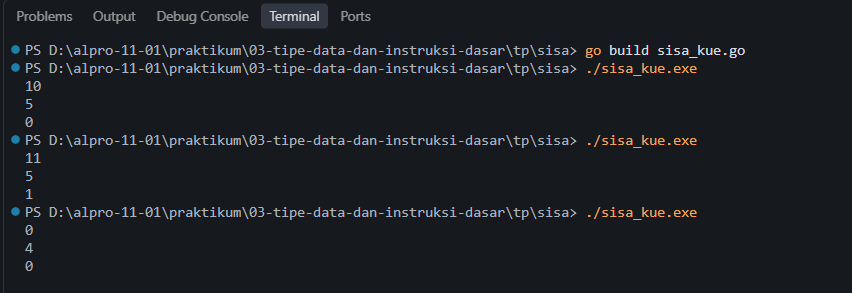
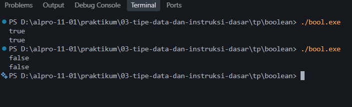
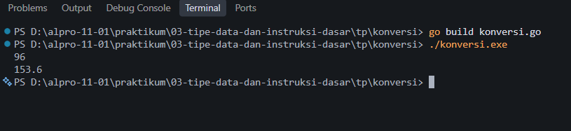

# <h1 align="center">Tugas Pendahuluan Modul 03 - Variabel dan Operator</h1>
<p align="center">Akmal Ghani Laoda - 109092600005</p>

### 1. Sisa Kue

```go
package main

import "fmt"

func main() {
	var y, x int

	fmt.Scan(&y, &x)
	fmt.Println(y % x)
}
```

##### Output



#### Deskripsi

Program ini digunakan untuk menghitung jumlah kue yang tersisa setelah sejumlah kue dibagikan secara sama rata kepada seluruh anggota keluarga. Program menerima dua input bilangan bulat, yaitu `y` sebagai jumlah kue dan `x` sebagai jumlah anggota keluarga. Operator modulus (`%`) digunakan untuk mendapatkan sisa pembagian `y` dengan `x`. Hasil tersebut kemudian ditampilkan sebagai jumlah kue yang tersisa.

Contoh, jika jumlah kue adalah 11 dan jumlah anggota keluarga adalah 5, maka `11 % 5 = 1`, sehingga terdapat 1 kue yang tersisa.

### 2. Membaca Nilai Boolean

```go
package main

import "fmt"

func main() {
	var nilai bool

	fmt.Scan(&nilai)
	fmt.Println(nilai)
}
```

##### Output



#### Deskripsi

Program ini digunakan untuk membaca dan mencetak nilai bertipe `bool` dalam bahasa Go. Variabel `nilai` memiliki tipe data `bool` yang dapat berisi `true` atau `false`. Program menerima nilai boolean dari input menggunakan `fmt.Scan`, kemudian mencetak kembali nilai tersebut menggunakan `fmt.Println`.

Contohnya, jika input yang diberikan adalah `true`, maka output yang dihasilkan juga `true`. Begitu juga jika input yang diberikan adalah `false`, maka output yang dihasilkan adalah `false`.

### 3. Konversi Mil ke Kilometer

```go
package main

import "fmt"

func main() {
	var mil float64

	fmt.Scan(&mil)

	km := mil * 1.6

	fmt.Printf("%.1f\n", km)
}
```

##### Output



#### Deskripsi

Program ini digunakan untuk mengonversi jarak dari satuan mil ke kilometer. Input yang diterima berupa bilangan desimal dengan tipe data `float64`. Nilai mil kemudian dikalikan dengan `1.6` berdasarkan ketentuan bahwa 1 mil sama dengan 1,6 kilometer.

Hasil konversi ditampilkan menggunakan `fmt.Printf("%.1f\n", km)` agar hasil memiliki tepat satu angka di belakang koma. Sebagai contoh, input `96` menghasilkan `153.6` kilometer.

## Kesimpulan

Berdasarkan ketiga program yang dibuat, dapat dipahami penggunaan variabel dan operator dasar dalam bahasa pemrograman Go. Program pertama menggunakan tipe data `int` dan operator modulus untuk mencari sisa pembagian. Program kedua menggunakan tipe data `bool` untuk membaca dan menampilkan nilai `true` atau `false`. Program ketiga menggunakan tipe data `float64`, operasi perkalian, serta format `%.1f` untuk menampilkan hasil konversi dengan satu angka di belakang koma.

Ketiga program tersebut menunjukkan bahwa pemilihan tipe data, penggunaan variabel, dan operator yang sesuai diperlukan agar input dapat diproses dan menghasilkan output sesuai dengan kebutuhan soal.
